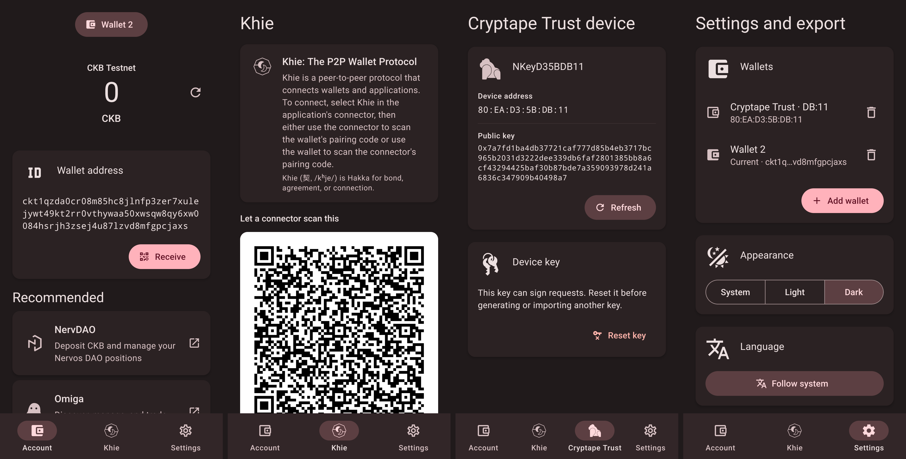

# Khie Wallet

> [!WARNING]
> This application and its source code were generated entirely by AI. It has not been independently reviewed or proven secure. Before using it, especially with real assets, you must understand the security, private-key management, transaction-signing and operational risks. Use it at your own risk.

Android-first Expo Development Build wallet MVP for CKB and the standard CCC Khie `SignerJsonRpc` protocol.



## Included

- Create and manage multiple BIP-39 wallets, or restore 12/24-word English mnemonics.
- Connect a Cryptape Trust/NKey hardware wallet over Android Bluetooth LE and use it as the active CKB signer.
- Derive one CKB account at `m/44'/309'/0'/0/0` for each wallet.
- Testnet/mainnet address and balance, receive QR, authenticated mnemonic/private-key export.
- Khie provider and connector QR directions, WSS relay fallback, WebRTC direct upgrade, single-peer authorization and per-request approval.
- System-aware and manually selectable UI languages: English, 简体中文, 正體中文 and 客家語.
- A deliberately small React Native Paper MD3 presentation layer, with wallet-specific theme tokens and replaceable wrapper components.
- Replaceable internal `SigningBackend`; Khie never reads or exposes a private-key field.

This MVP intentionally excludes in-app transfers, tokens, history, persistent dapp authorization and release signing.

## Cryptape Trust


As a small hardware-wallet easter egg, the Android app can connect to the experimental Cryptape Trust over Bluetooth LE and use it as a CKB signer. The device and its [original app](https://github.com/cryptape/trust-android) have been unmaintained for years and the protocol has known security weaknesses, so this integration is intended for testnet experiments—not mainnet assets.

## Android development build

Prerequisites: Node.js 24, pnpm 12, JDK 17 or newer, Android Studio/SDK, an emulator or USB device with biometric authentication enrolled.

Make sure Gradle can find the SDK through `ANDROID_HOME`/`ANDROID_SDK_ROOT`, or set `sdk.dir` in `android/local.properties` after prebuild.

```sh
pnpm install
pnpm prebuild --platform android
pnpm android
```

Expo Go cannot run this app because `react-native-webrtc` requires native modules. The generated `android/` directory is intentionally ignored and should be regenerated from `app.json` and `app.config.ts`.

For a local development APK after prebuild:

```sh
cd android
./gradlew assembleDebug
```

The APK is written to `android/app/build/outputs/apk/debug/app-debug.apk`.

## Automated APK releases

Pushing a tag whose name starts with `v` runs the Android release workflow:

```sh
git tag v0.1.0
git push origin v0.1.0
```

The workflow runs the TypeScript checks and tests, generates the Android project, and publishes standalone Hermes APKs plus their SHA-256 checksums to GitHub Releases. It provides individual `arm64-v8a`, `armeabi-v7a`, `x86` and `x86_64` APKs, plus a universal APK containing all four Android architectures.

The current release variant uses the Expo-generated Android debug keystore. It is installable without Metro, but it is a development build and is not suitable for Play Store distribution or production asset custody.

## Checks

```sh
pnpm typecheck
pnpm test
pnpm doctor:expo
```

Golden tests verify the mobile zlib pairing endpoint codec in both directions against `@ckb-ccc/libp2p`.
The Trust/NKey bridge is adapted from the MIT-licensed [`cryptape/trust-android`](https://github.com/cryptape/trust-android) reference implementation; its license is included with the local Expo module.

## Khie behavior

- Default relay: `/dns4/relay.ckbccc.com/tcp/443/wss`
- Pairing protocol: `/nervos-ckb/khie/pairing/0.0.1`
- RPC protocol: `/nervos-ckb/khie/json-rpc/0.0.1`
- 1 MiB request limit, 120 second approval timeout and 30 minute disconnected pairing expiry.
- Pairings are process-scoped. Restarting the app requires pairing again.
- Entering the background cancels pending approvals. Returning to the foreground performs one lightweight relay/direct-address check; the connector's retry and inbound dialing remain the main recovery path.

## Limitations and risk

This is a development MVP, not a production wallet. It has not received a security audit, release hardening or Play Store review. Testnet is the default. Mainnet use and asset risk are the user's responsibility. Real-device acceptance still requires testing both QR directions, relay-only operation and an observed `direct === true` WebRTC connection against the current CCC Connector page.
